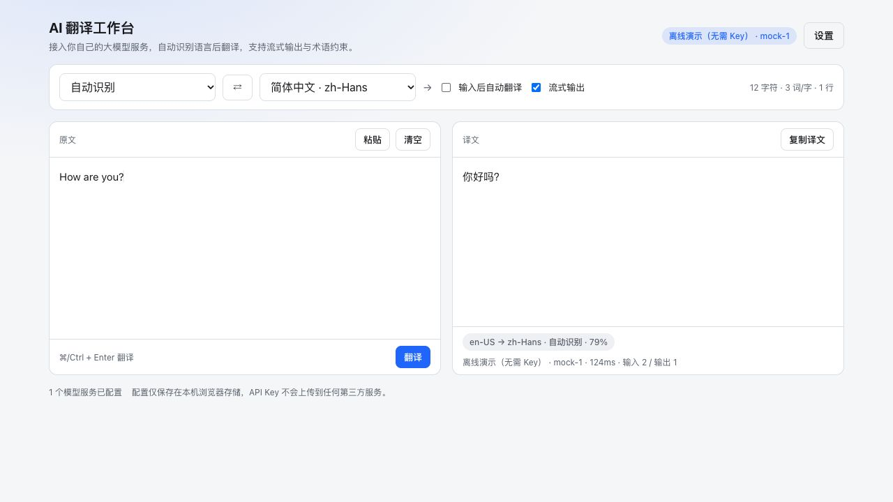
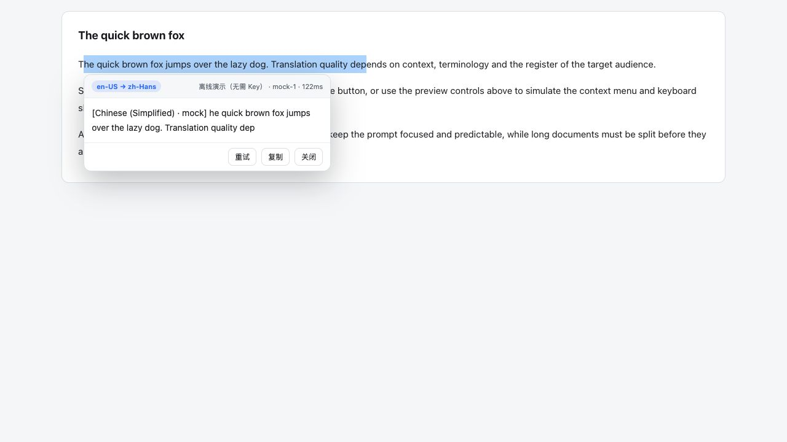

# AI 翻译（AI Translator）

一个基于大模型的翻译应用，同时提供 **Web 应用** 与 **浏览器扩展** 两种形态。

- 可接入任意 **自定义大模型 Provider**（OpenAI 兼容协议 / Anthropic / Gemini，含本地 Ollama、LM Studio、自建网关）
- 翻译 **from → to** 支持 **自动识别源语言**，覆盖中文（简/繁）、英语（美/英）、日语、韩语等 31 种主流语言
- 内置桌面级翻译工作台：流式输出、术语表约束、语气/领域控制、译文缓存、长文自动分段
- 扩展形态：**选中即译**（浮动按钮 + 右键菜单 + `Alt+Shift+T` 快捷键，macOS 上是 `⌥⇧T`）、弹窗快速翻译、设置页

## 界面

| Web 翻译工作台 | 扩展：选中即译 |
| --- | --- |
|  |  |

两张截图都用内置的**离线演示 Provider** 录制（无需 API Key），可直接复现：`pnpm dev:web` 与 `pnpm preview:extension`。

## 目录结构

```
packages/core          翻译引擎：语言识别、提示词、分段、缓存、Provider 适配（零运行时依赖）
packages/ui            React 18 组件：设置面板、语言选择、格式化工具
apps/web               Web 应用（Vite + React 18）
apps/extension         Chrome/Edge MV3 扩展（Vite 打包：background / content / popup / options）
apps/extension/preview 扩展本地预览台（chrome.* 桩，加载真实入口文件）
AGENTS.md              贡献约定：目录职责、命令、风格、测试与提交规范
```

`packages/core` 不依赖任何运行时 npm 包，也不依赖 DOM，因此同一份逻辑同时跑在浏览器、扩展 Service Worker 和 Node 测试里；React 只出现在 `packages/ui` 与两个应用外壳中。

包间引用统一走包名（`@ai-translator/core`、`@ai-translator/ui`、`@ai-translator/ui/format`、`@ai-translator/ui/styles.css`）：pnpm 在 `apps/*/node_modules/@ai-translator/*` 建软链，各包 `exports` 直接指向 TypeScript 源码，所以 Vite、`tsc`、Node 都按标准解析，**不需要** `resolve.alias`，也不需要在 tsconfig 里重复维护 `paths`。

## 技术栈

| 关注点 | 选型 |
| --- | --- |
| 依赖管理 | pnpm workspace（`pnpm-workspace.yaml`，包间用 `workspace:*` 引用） |
| 前端框架 | React 18.3（Web 与扩展共用同一批 `@ai-translator/ui` 组件） |
| 构建 | Vite 8 + `@vitejs/plugin-react`（扩展额外产出两个自包含 IIFE bundle） |
| 语言/类型 | TypeScript 5（`strict` + `noUncheckedIndexedAccess`），测试由 Node 22 原生运行 `.ts` |
| 测试 | Node 22 内置 `node:test`，81 个用例（71 引擎 + 2 UI + 8 扩展清单/产物） |
| 引擎依赖 | 运行时零依赖（`packages/core` 是纯 TypeScript） |

扩展图标由 `apps/extension/scripts/make-icons.ts` **程序化生成**（SDF 图形 + 5×5 超采样，无字体依赖）：蓝色圆角底 + 两个错位叠加的白框（后框「中」、前框「A」）+ 两段旋转弧线；16px 会自动省略字形只保留轮廓。`pnpm --filter @ai-translator/extension icons` 可重新生成，128px 同时作为 Web 端 favicon（`apps/web/public/icon-128.png`）。

## 快速开始

前置要求：Node.js ≥ 22.6（可直接运行 TypeScript）、pnpm ≥ 9（依赖管理与脚本编排）。

```bash
# 安装 workspace 内所有依赖
pnpm install

# Web 应用
pnpm dev:web               # Vite 开发服务器 http://localhost:5173
pnpm build:web             # 产物在 apps/web/dist

# 浏览器扩展
pnpm build:extension       # 产物在 apps/extension/dist
pnpm dev:extension         # 三个 target 并行 watch 重建
pnpm preview:extension     # 本地预览扩展 UI：http://localhost:4174
```

加载扩展：打开 `chrome://extensions` → 打开「开发者模式」→「加载已解压的扩展程序」→ 选择 `apps/extension/dist`。

## 发布扩展

`.github/workflows/release-extension.yml` 负责产出可直接加载 / 上传商店的扩展压缩包：

1. 先把 `apps/extension/manifest.json` 的 `version` 改成要发布的版本（Chrome 要求版本递增）
2. 打 tag 并推送：`git tag v0.1.0 && git push origin v0.1.0`
3. workflow 依次执行 `pnpm verify` → 打包 → 上传 artifact → 创建（或更新）Release，附件为 `ai-translator-extension-v0.1.0.zip`

tag 与 manifest 版本不一致会直接失败，避免发出「tag 是 0.2.0、包里是 0.1.0」的包。也可以在 Actions 里手动 `workflow_dispatch` 试跑：只产出 artifact、不创建 Release，重复跑同一个 tag 会覆盖已有附件。压缩包内 `manifest.json` 位于根目录，sourcemap 不入包。

本地复现同样的产物：`pnpm build:extension && (cd apps/extension/dist && zip -r ../../../extension.zip . -x '*.map')`。

### 不安装也能验证扩展

`apps/extension/preview/` 提供一份最小的 `chrome.*` 桩（`chrome-stub.ts`，实现了 `runtime` 消息、`storage`、`tabs`、`scripting`、`contextMenus`、`commands`），并用它加载扩展的**真实入口文件** `background.ts` / `content.tsx` / `popup.tsx` / `options.tsx`，翻译走离线演示 Provider。因此无需把扩展装进浏览器即可验证各入口与边界场景：

- `popup.html` — 打开即模拟「读取当前页面选区 → 翻译」
- `content.html` — 拖选文字触发浮动「译」按钮；页面上的预览控制台还能直接模拟右键菜单与快捷键
- `content.html?stale` — 模拟「扩展重新加载后页面里旧 content script 的 chrome.* 已失效」，用于验证此时会提示刷新页面而不是一直卡在「翻译中…」
- `built.html` — **直接加载 `apps/extension/dist/content.js` 真实 IIFE 产物**并回显挂载状态，用来抓「dev 能跑、打包后挂掉」这类问题
- `options.html` — 设置面板（增删模型服务、测试连接、术语表等）

该目录只在本地预览时使用，不会被构建进 `apps/extension/dist`；给页面加上 `?bare` 可隐藏预览工具条（README 截图就是这么来的）。

首次打开无需任何 API Key：默认启用内置的 **离线演示 Provider**，用内置词典演示完整链路（识别 → 分段 → 请求 → 流式渲染 → 缓存）。要翻译真实内容，请在「设置 → 模型服务」里添加你自己的模型服务。

## 模型服务配置

内置预设（一键添加后填写 API Key / 模型名即可）：

| 预设 | 协议 | 默认 Base URL |
| --- | --- | --- |
| OpenAI / DeepSeek / Moonshot / 通义 / 智谱 / SiliconFlow / OpenRouter / Groq / Together / Mistral / xAI | OpenAI 兼容 | 各家官方地址 |
| Ollama / LM Studio / vLLM | OpenAI 兼容 | `http://localhost:11434/v1` 等 |
| Azure OpenAI | OpenAI 兼容 | 需自定义 `path` 与 `apiKeyHeader` |
| One API / New API 等聚合网关 | OpenAI 兼容 | 自填网关地址 |
| Anthropic Claude | Messages API | `https://api.anthropic.com` |
| Google Gemini | generateContent | `https://generativelanguage.googleapis.com` |

每个 Provider 可配置：`baseUrl`、`apiKey`、`model`、`path`、`modelsPath`、`apiKeyHeader`、`apiKeyPrefix`、自定义 `headers`/`body`、`timeoutMs`、`streamUsage`。设置面板支持「测试连接」和「获取模型列表」。

配置保存在浏览器本地（Web 用 `localStorage`，扩展用 `chrome.storage.local`），**API Key 不会上传到除该 Provider 之外的任何地方**；导出配置时默认隐藏 Key。

## 翻译管线

1. **语言识别**：先跑本地规则（Unicode 脚本分析 + 拉丁语种停用词/变音符打分），置信度不足时按配置回退到模型识别或默认源语言。策略可选 `hybrid`（默认）/ `heuristic` / `llm`。
2. **是否跳过**：源语言与目标语言同族且识别可信时跳过请求，直接返回原文。
3. **保护占位符**：代码块、行内代码、URL、邮箱、HTML 标签、`{{var}}`、`${var}`、`%s`、ICU 复数等替换为占位符，模型只翻译自然语言部分，返回后还原。占位符被模型破坏时自动重试一次。
4. **分段**：按句边界切分到 `chunkSize` 字符，保证拼接后与原文逐字符一致（句尾空白跟随上一段）。
5. **请求**：默认逐段并发送，也可开启 JSON 批量模式（一次请求翻译多段，失败自动降级）。
6. **缓存**：以 provider + model + 语言对 + 语气 + 术语表 + 提示词 + 文本的哈希为键做 LRU 缓存。
7. **流式输出**：`streamTranslate()` 逐块产出增量，Web 与扩展弹窗均支持。

## 提示词与术语表

- 语气风格：中性 / 正式书面 / 口语随意 / 技术文档 / 营销文案 / 学术论文 / 直译
- 领域、目标读者、上下文背景均可填写，会注入系统提示词
- 术语表（`原文 = 译文`，每行一条）作为强约束下发，要求模型必须使用指定译法
- 需要完全自定义时，可在配置中提供 `systemPromptOverride`

## 包内 API 速查

```ts
import { Translator, createProvider, detectLanguage, LANGUAGES } from "@ai-translator/core";

const translator = new Translator({ config });

await translator.translate("Hello world.", { to: "zh-Hans" });
// → { text, source: { language, confidence, method }, target, model, cacheHit, latencyMs, usage }

await translator.translate(["First.", "Second."]);  // 数组即批量（带并发上限）

for await (const event of translator.streamTranslate(text)) {
  if (event.type === "delta") render(event.text);
}

await translator.detect("こんにちは");              // 只做识别
await translator.checkProvider();                   // 连通性自检
```

## 开发

```bash
pnpm typecheck      # tsc 全量类型检查（含 vite 配置与预览台）
pnpm test           # node --test，81 个用例（71 引擎 + 2 UI + 8 扩展）
pnpm check          # typecheck + test
pnpm verify         # build + typecheck + test（会让扩展产物相关用例真正执行）
pnpm build          # 构建 web + extension
pnpm clean          # 清理 dist 与 node_modules
```

测试直接运行 TypeScript（Node 22 原生类型剥离），无需构建步骤；Provider 测试通过注入 `fetchImpl` 桩实现，不发真实请求；扩展的清单/图标/产物校验在 `apps/extension/test/extension.test.ts`，未构建时会跳过产物相关断言。

改动前请先读 `AGENTS.md`：它规定了 `packages/core` 的依赖边界、命名与缩进约定、测试要求，以及扩展改动的验证路径（`pnpm verify` + 预览台 `built.html`）。

### 扩展的三种 Vite 产物

`apps/extension/vite.config.ts` 用 `BUILD_TARGET` 切换三个目标，`pnpm build:extension` 依次执行：

| target | 产物 | 说明 |
| --- | --- | --- |
| `pages` | `popup.html`、`options.html` + `assets/*` | 多页面 React 应用，并把 `manifest.json` 与 `icons/` 拷进 `dist/` |
| `background` | `background.js` | 自包含 IIFE，无需 `"type": "module"` |
| `content` | `content.js` | 自包含 IIFE，MV3 content script 必须是经典脚本 |

如果要换成某个扩展框架（WXT / Plasmo / CRXJS 等），只需要替换 `apps/extension/{manifest.json,vite.config.ts,src/*}`；`packages/core`、`packages/ui` 与 `apps/extension/src/store.ts` 可原样复用。

## 已知限制

- 浏览器扩展目前只声明 MV3；Firefox 需要自行调整 `manifest.json`（`background.scripts`）。
- 页面内浮动卡片不处理 iframe 内的选区（`all_frames: false`），可在需要时打开。
- 识别器聚焦主流语言；未收录语种（如荷兰语与南非语混合短句）会落到默认源语言。
- 扩展的 Service Worker 会在空闲后被回收，译文缓存随内存一起消失。
- 在 `chrome://extensions` **重新加载扩展后，已打开页面里的旧 content script 会失去 `chrome.*` 绑定**（UI 还在但调用已失效）。此时扩展会提示「扩展已重新加载，请刷新当前页面」，刷新页面即可恢复；快捷键与右键菜单不受影响，因为它们由后台重新注入/推送。
- 快捷键在 manifest 里写作 `Alt+Shift+T`，Chrome 在 macOS 上会把 `Alt` 映射成 Option，实际按键是 `⌥⇧T`，界面文案会按平台自动切换。若与其它应用冲突，可在 `chrome://extensions/shortcuts` 改绑。
- content script 内联了 React（`content.js` 约 143 KB / gzip 约 48 KB，已是 React 生产版），因为 MV3 不允许 content script 使用 ESM 分块；若在意体积可改用 Preact 或原生 DOM 实现该卡片。
- 扩展的 IIFE 构建（lib 模式）**不会自动替换 `process.env.NODE_ENV`**，必须在 `apps/extension/vite.config.ts` 里显式 `define`，否则 React 会让脚本在加载时抛 `process is not defined`。`apps/extension/test/extension.test.ts` 里有对应的防回归断言。
